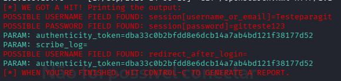

# Simulação de Phishing para Fins Educacionais

## Ferramentas

- Kali Linux
- SEToolkit

## Configurando o Phishing no Kali Linux

- Acesso root: `sudo su`
- Iniciando o SEToolkit: `setoolkit`
- Tipo de ataque: `Social-Engineering Attacks`
- Vetor de ataque: `Web Site Attack Vectors`
- Método de ataque: `Credential Harvester Attack Method`
- Método utilizado: `Web Templates`
- Obtendo o endereço da máquina: `ifconfig`
- Clone utilizado: `Twitter`

## Resultados

## Aviso

Este projeto foi desenvolvido exclusivamente para fins educacionais,
em ambiente controlado e autorizado, com o objetivo de estudar
conceitos relacionados a phishing e Segurança da Informação.
